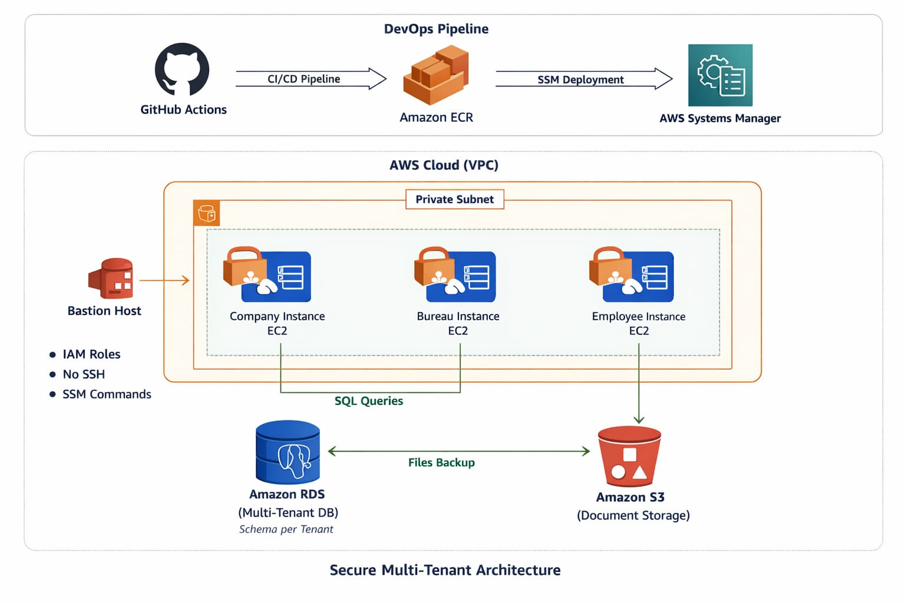

# 🚀 DevOps Project – Oceans Across

## 📌 Overview

This project demonstrates a **secure, scalable, multi-tenant payroll platform infrastructure** built using AWS and Terraform.

The solution follows a **security-first, cloud-native approach** with:

* Multi-tenant isolation
* Secure CI/CD pipeline
* IAM-based access control
* No hardcoded secrets
* Fully automated deployment

---

# 🏗️ Architecture Diagram



### 🔄 Architecture Flow

* GitHub Actions builds and pushes Docker image to ECR
* AWS SSM deploys application to EC2 instances
* Each EC2 instance serves a tenant (Company, Bureau, Employee)
* RDS stores tenant data (schema-per-tenant)
* S3 stores tenant-specific documents

---
```
.
├── app/                              # Backend application (Node.js)
│   ├── db.js
│   ├── index.js
│   ├── middleware.js
│   └── package.json
│
├── .github/workflows/                  # CI/CD pipeline
│   └── deploy.yml
│
└── terraform/                           # Infrastructure as Code
│    ├── backends
│    │   └── dev.hcl
│    ├── ec2
│    │   ├── main.tf
│    │   ├── output.tf
│    │   ├── provider.tf
│    │   └── variables.tf
│    ├── iam
│    │   ├── main.tf
│    │   ├── output.tf
│    │   ├── provider.tf
│    │   └── variables.tf
│    ├── main.tf
│    ├── output.tf
│    ├── provider.tf
│    ├── rds
│    │   ├── main.tf
│    │   ├── output.tf
│    │   ├── provider.tf
│    │   └── variable.tf
│    ├── s3
│    │   ├── main.tf
│    │   ├── output.tf
│    │   ├── provider.tf
│    │   └── variables.tf
│    ├── SecurityGroup
│    │   ├── main.tf
│    │   ├── output.tf
│    │   ├── provider.tf
│    │   └── variables.tf
│    ├── ssh-keys
│    ├── tfvars
│    │   └── dev.tfvars
│    ├── variables.tf
│    └── vpc
│        ├── main.tf
│        ├── output.tf
│        ├── provider.tf
│        └── variables.tf
│
├── Dockerfile
├── architecture.png
├── ai_log.md
└── README.md

```
---
---

## ⚙️ Terraform Setup & Usage

### 📋 Prerequisites

- Terraform >= 1.5
- AWS CLI installed
- AWS credentials configured:
  ```
  aws configure
  ```
- Required AWS permissions: EC2, VPC, RDS, IAM, S3

---

### 📁 Navigate to Terraform Directory

```
cd terraform
```

---

### 🔧 Initialize Terraform

```
terraform init -backend-config=backends/dev.hcl
```

---

### 📦 Validate

```
terraform validate
```

---

### 📊 Plan

```
terraform plan -var-file="tfvars/dev.tfvars"
```

---

### 🚀 Apply

```
terraform apply -var-file="tfvars/dev.tfvars"
```

Auto approve:

```
terraform apply -var-file="tfvars/dev.tfvars" -auto-approve
```

---

### 📤 Output

```
terraform output
```

### 🧹 Destroy Infrastructure

```
terraform destroy -var-file="tfvars/dev.tfvars"
```

Auto approve:

```
terraform destroy -var-file="tfvars/dev.tfvars" -auto-approve
```
### 🌍 Environment Support

- Dev → tfvars/dev.tfvars
- Prod → tfvars/prod.tfvars

---

### 🔐 Best Practices

- No hardcoded secrets
- IAM role-based access
- Modular Terraform structure
- Environment-based configs

---

### ⚠️ Notes

- Always run plan before apply
- Destroy infra after use to avoid charges
- Do not commit .tfstate files

---

---


# 🔐 Multi-Tenancy Architecture 

## Tenant Isolation Strategy

A **schema-per-tenant model** is used in PostgreSQL.

* Each tenant has its own schema:

  * `company_123`
  * `bureau_456`
  * `employee_789`

### Tenant Context Flow

1. User logs in → JWT generated
2. JWT contains `tenant_id`
3. Backend extracts tenant
4. DB connection sets:

   ```
   SET search_path TO <tenant_schema>;
   ```

👉 Ensures strict tenant isolation

---

## Infrastructure-Level Isolation

* Separate IAM roles per tenant
* S3 prefix isolation:

  ```
  s3://bucket/company/
  s3://bucket/bureau/
  s3://bucket/employee/
  ```
* Security groups prevent cross-tenant communication

---

### Tenant Lifecycle Management

#### Onboarding
- Create schema in PostgreSQL
- Assign IAM role
- Create S3 prefix
- Store tenant metadata

#### Offboarding
- Backup and delete tenant data
- Remove IAM roles and access
- Clean up S3 data
- Maintain audit logs

---

### Security Approach

A defense-in-depth strategy is implemented where multiple layers enforce tenant isolation:
#### IAM & RBAC

* Least privilege access
* Separate roles per tenant
* No wildcard permissions

#### Secrets Management

* AWS Secrets Manager used
* Credentials injected at runtime
* No secrets in code or CI/CD

#### Encryption

* RDS encryption enabled
* S3 encryption enabled
* TLS enforced for all services

#### Network Security

* EC2 in private subnets
* RDS not publicly accessible
* Access via Bastion / SSM

---

# 🚀 CI/CD Pipeline

## Workflow

1. Code pushed to GitHub
2. Docker image built
3. Image pushed to Amazon ECR
4. Deployment via AWS SSM
5. EC2 pulls image and restarts container

## Key Features

* Uses **OIDC (no static AWS credentials)**
* No SSH required
* Fully automated deployment

---

# 📊 Monitoring & Incident Readiness 

## Monitoring

* CloudWatch alarms:

  * EC2 CPU utilization
  * RDS connections

## Logging

* Centralized CloudWatch logs
* Retention policy configured

## Alerts

* SNS notifications for critical events

---

## 🧯 Incident Runbook

### Scenario: RDS publicly exposed

**Detection**

* CloudWatch alert triggered

**Investigation**

* Check security groups
* Verify public access settings

**Mitigation**

* Restrict access immediately
* Rotate credentials

**Prevention**

* Use AWS Config rules
* Enforce Terraform policies

---

# 🇬🇧 UK GDPR Compliance

## Data Protection

* Encryption at rest & in transit
* IAM-based access control
* CloudTrail auditing

## Data Residency

* Resources deployed in EU region

## Right to Erasure

* Delete data from RDS & S3
* Remove backups
* Maintain audit logs

---

# 🔐 Secrets Management

* Secrets stored in AWS Secrets Manager
* Retrieved at runtime via IAM roles
* Injected as environment variables into containers

---

# 🔥 Security Highlights

* No SSH exposure (SSM used)
* No hardcoded credentials
* Private container registry (ECR)
* Multi-layer isolation (App + DB + IAM + Network)

---

# 🧠 Design Decisions

* Schema-per-tenant → balance of security & cost
* SSM over SSH → better security & auditability
* ECR over DockerHub → IAM-based authentication
* IAM roles → strict access boundaries

---

# ⚠️ Note

Infrastructure is defined using Terraform and is **not deployed** to avoid unnecessary AWS costs, as allowed in the assignment.

---

# 🤖 AI Usage Log

Refer to `ai_log.md` for complete AI usage documentation.

---

# 🏆 Final Statement

This solution demonstrates a **secure, scalable, and production-ready DevOps architecture** with strong multi-tenancy isolation, automated CI/CD, and compliance-ready design.